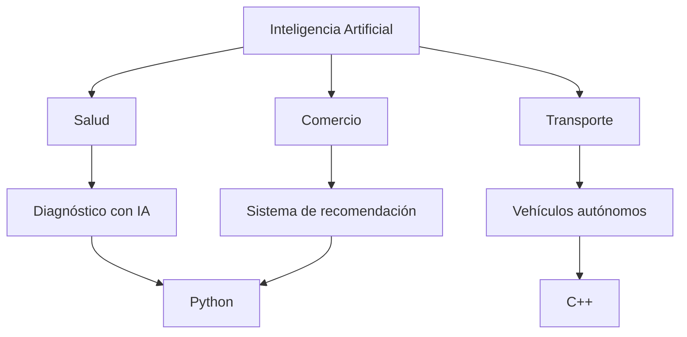

# Práctica IA (RA4 · d+e) — Sectores con implantación relevante y lenguajes de programación en IA

## 1) Introducción
**Objetivo de la práctica:**  
Analizar algunos sectores donde la Inteligencia Artificial (IA) tiene una implantación importante y estudiar los lenguajes de programación más utilizados para desarrollar aplicaciones de IA.

**Relación con DAW/DAM:**  
Los desarrolladores de aplicaciones web (DAW) y multiplataforma (DAM) cada vez utilizan más servicios de IA para mejorar sus aplicaciones. Por ejemplo, sistemas de recomendación, chatbots, análisis de datos o reconocimiento de imágenes.

---

# 2) Sectores con implantación relevante de IA

## Sector 1
- **Nombre del sector:** Salud  
- **Tipo de empresa/servicio:** Hospitales, clínicas, laboratorios médicos  
- **Aplicación de IA:** Diagnóstico asistido por IA mediante análisis de imágenes médicas  
- **Qué tarea mejora o automatiza:** Detecta enfermedades en radiografías, resonancias o TAC  
- **Por qué la IA tiene implantación relevante en este sector:** Permite analizar grandes cantidades de datos médicos con gran precisión  
- **Beneficios que aporta:**  
  - Diagnósticos más rápidos  
  - Reducción de errores médicos  
  - Apoyo a los profesionales sanitarios  

---

## Sector 2
- **Nombre del sector:** Comercio electrónico  
- **Tipo de empresa/servicio:** Tiendas online, plataformas de venta digital  
- **Aplicación de IA:** Sistemas de recomendación de productos  
- **Qué tarea mejora o automatiza:** Sugiere productos a los usuarios según sus intereses  
- **Por qué la IA tiene implantación relevante en este sector:** Las empresas manejan grandes volúmenes de datos sobre comportamiento de usuarios  
- **Beneficios que aporta:**  
  - Mejora la experiencia del cliente  
  - Aumenta las ventas  
  - Personalización de la plataforma  

---

## Sector 3
- **Nombre del sector:** Transporte y movilidad  
- **Tipo de empresa/servicio:** Empresas de transporte, movilidad urbana, vehículos autónomos  
- **Aplicación de IA:** Sistemas de conducción autónoma y optimización de rutas  
- **Qué tarea mejora o automatiza:** Control del vehículo, detección de obstáculos y planificación de rutas  
- **Por qué la IA tiene implantación relevante en este sector:** La IA permite analizar datos del entorno en tiempo real  
- **Beneficios que aporta:**  
  - Mayor seguridad  
  - Reducción del tráfico  
  - Optimización del transporte  

---

# 3) Lenguajes de programación en IA

## Lenguaje 1
- **Nombre:** Python  
- **Uso principal en IA:** Desarrollo de modelos de Machine Learning y Deep Learning  
- **Ventajas:**  
  - Gran número de librerías (TensorFlow, PyTorch, Scikit-learn)  
  - Fácil de aprender  
  - Gran comunidad de desarrolladores  
- **Ejemplos de uso:**  
  - Sistemas de recomendación  
  - Análisis de datos  
  - Chatbots  

---

## Lenguaje 2
- **Nombre:** R  
- **Uso principal en IA:** Análisis estadístico y ciencia de datos  
- **Ventajas:**  
  - Muy potente para análisis de datos  
  - Muchas librerías estadísticas  
- **Ejemplos de uso:**  
  - Modelos predictivos  
  - Análisis de datos científicos  

---

## Lenguaje 3
- **Nombre:** Java  
- **Uso principal en IA:** Aplicaciones empresariales con IA integrada  
- **Ventajas:**  
  - Alta estabilidad  
  - Amplio uso en grandes empresas  
- **Ejemplos de uso:**  
  - Sistemas de recomendación en plataformas grandes  
  - Aplicaciones backend con IA  

---

## Lenguaje 4
- **Nombre:** C++  
- **Uso principal en IA:** Sistemas que requieren alto rendimiento  
- **Ventajas:**  
  - Gran velocidad de ejecución  
  - Control sobre el hardware  
- **Ejemplos de uso:**  
  - Sistemas de visión artificial  
  - Robots y vehículos autónomos  

---

# 4) Relación entre sectores, tipo de IA y lenguaje

| Sector | Aplicación de IA | Tipo de IA/técnica | Lenguaje recomendado | Justificación |
|------|------|------|------|------|
| Salud | Diagnóstico por imágenes | Visión artificial / Deep Learning | Python | Tiene librerías especializadas en IA médica |
| Comercio electrónico | Recomendación de productos | Machine Learning | Python | Facilita el análisis de datos de usuarios |
| Transporte | Conducción autónoma | Visión artificial y aprendizaje profundo | C++ | Necesita alto rendimiento y procesamiento rápido |

---

# 5) Diagrama (Mermaid)

---

## 6) Riesgos y mitigación
- Riesgo 1: Uso incorrecto o sesgado de los datos
- Mitigación 1: Utilizar datasets variados y revisar los modelos regularmente
- Riesgo 2: Problemas de privacidad de los usuarios
- Mitigación 2: Aplicar normas de protección de datos y anonimización de la información
---
## 7) Conclusión
- **Qué sectores destacan más:**
  - Salud, comercio electrónico y transporte destacan por la gran cantidad de datos que generan y
    por el impacto que puede tener la IA en mejorar sus servicios
- **Qué lenguajes aparecen con más frecuencia:**
  - Python es el lenguaje más utilizado en IA debido a su facilidad de uso y su gran ecosistema de librerías
- **Qué importancia tiene esto para DAW/DAM:**
  - Los desarrolladores web y multiplataforma pueden integrar IA en sus aplicaciones mediante APIs, análisis de datos o
    sistemas inteligentes que mejoren la experiencia de los usuarios
---
## 8) Fuentes oficiales (mín. 2)
- **Fuente 1 (sectores / aplicación IA):**
  - https://digital-strategy.ec.europa.eu/en/policies/artificial-intelligence
- **Fuente 2 (lenguajes / ecosistema técnico):**
  - https://www.ibm.com/topics/artificial-intelligence
